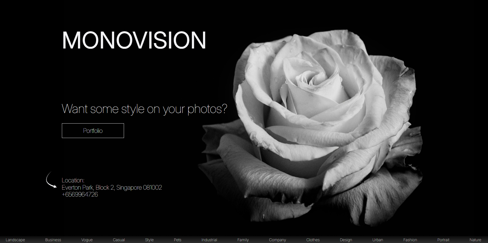
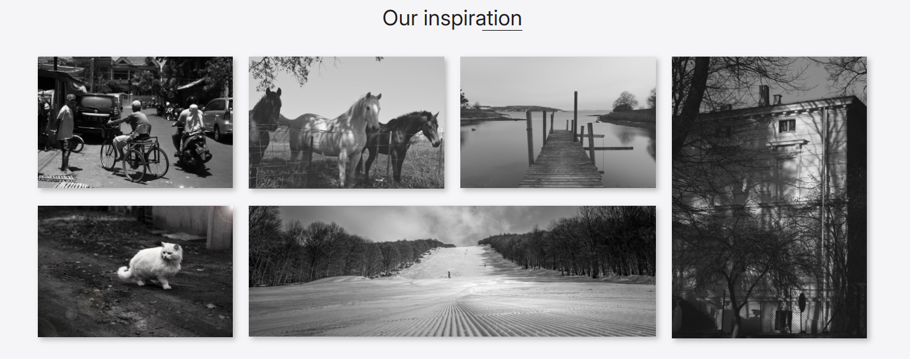

# Monovision Landing

A simple, stylish one-page landing website built with semantic HTML and modern CSS techniques.  
This project was created as part of frontend training, based on a static design layout.

🔗 **Live demo**: [https://mal3v14.github.io/monovision-landing/](https://mal3v14.github.io/monovision-landing/)

---

## 📸 Preview

---

## ⚙️ Tech Stack

- **HTML5**
- **CSS3**
- Responsive layout
- BEM methodology
- Semantic markup

---

## 📌 About the project

This landing page was created as a learning project to improve frontend layout skills.  
The structure and styles were implemented based on a static Figma layout provided by the course author.

The main focus was:
- Clean, maintainable code
- Semantic structure
- Pixel-perfect result
- Fully responsive across devices

---
